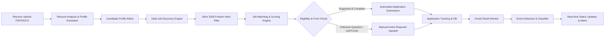
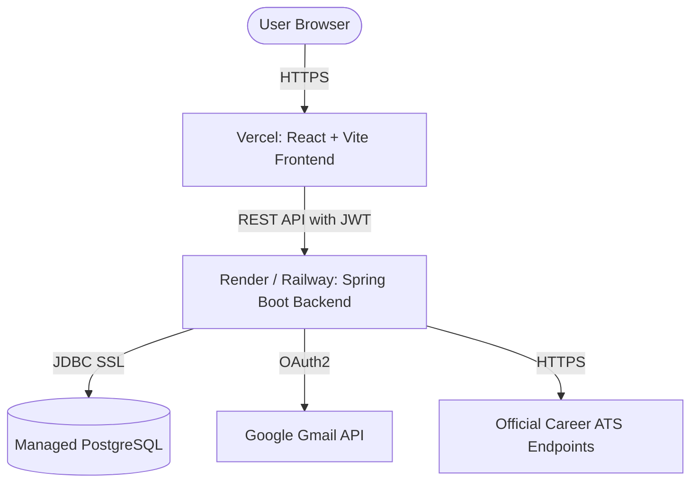

# Personalized AI Job Application Agent (MVP)

A production-ready, autonomous, and human-in-the-loop AI Job Application Agent tailored for **Indian IT/Software 2026 Freshers**.

[](https://github.com/Bharath-342/ai-job-agent/actions/workflows/ci.yml)


**GitHub Repository:** [https://github.com/Bharath-342/ai-job-agent](https://github.com/Bharath-342/ai-job-agent)

---

## 📌 Architecture Overview



---

## 🚀 Key Features

1. **Intelligent Resume Parsing**: Ingests PDF and DOCX resumes, extracting contact info, education, skills, degree, 2026 batch, and projects into an editable profile.
2. **Strict India & 2026 Fresher Guardrails**:
   - Hard filters out foreign roles (US, UK, Europe, foreign remote).
   - Validates 2026 batch / 0–1 year experience.
   - Rejects 2+ years, Senior, Lead, or Manager positions.
3. **Multi-Dimensional Job Matching**: Calculates skill match, role match, experience match, and location match (default threshold: 85%).
4. **Zero-Hallucination Form Auto-Fill**: Automatically fills only verified fields (name, email, phone, education, resume). Stops immediately with `MANUAL_ACTION_REQUIRED` on any unknown mandatory question or CAPTCHA.
5. **Human-in-the-Loop Handoff**: Provides an interactive modal and direct application portal link with pre-filled instructions and 1-click status sync.
6. **Real Gmail Integration & Event Classification**: Secure OAuth2 connection to detect real ATS events:
   - `APPLICATION_RECEIVED`
   - `UNDER_REVIEW`
   - `ASSESSMENT_RECEIVED`
   - `INTERVIEW_INVITATION`
   - `INTERVIEW_SCHEDULED`
   - `REJECTED_BY_COMPANY`
   - `OFFER_RECEIVED`
7. **Rate Limiting & Anti-Spam Guardrails**: Daily quota enforcement (default 10 applications/day) and multi-field deduplication.
8. **Dual Mode Execution**:
   - `MOCK_MODE=true`: Safely simulates discovery, parsing, matching, and application lifecycles with mock ATS and test workflows.
   - `MOCK_MODE=false`: Connects to live production endpoints, real Gmail APIs, and verified ATS webhooks.

---

## 🛠️ Technology Stack

| Layer | Technology |
|---|---|
| **Frontend** | React 18, Vite, Tailwind CSS, Lucide Icons, Axios |
| **Backend** | Java 21 / 25, Spring Boot 3.3.4, Spring Security, Flyway |
| **Database** | PostgreSQL (Production) / H2 in PostgreSQL mode (Local Test) |
| **Parsing** | Apache PDFBox, Apache POI (DOCX) |
| **Email** | Google Gmail API (OAuth2) |
| **Documentation** | OpenAPI 3.0 / Swagger UI |
| **CI/CD** | GitHub Actions, Docker, Docker Compose |

---

## ⚙️ Environment Variables

Copy `.env.example` to `.env` or set the following variables:

| Variable | Description | Default / Example |
|---|---|---|
| `DATABASE_URL` | PostgreSQL JDBC connection URL | `jdbc:postgresql://localhost:5432/jobagent` |
| `DATABASE_USERNAME` | Database username | `postgres` |
| `DATABASE_PASSWORD` | Database password | `postgrespassword` |
| `JWT_SECRET` | Secret key for JWT token generation | 64-char hex string |
| `GOOGLE_CLIENT_ID` | Google OAuth2 Client ID for Gmail API | (Obtained from Google Cloud Console) |
| `GOOGLE_CLIENT_SECRET` | Google OAuth2 Client Secret | (Obtained from Google Cloud Console) |
| `GOOGLE_REDIRECT_URI` | Google OAuth2 Redirect URI | `http://localhost:8080/api/auth/google/callback` |
| `FRONTEND_URL` | Deployed/Local Frontend URL | `http://localhost:5173` |
| `BACKEND_URL` | Deployed/Local Backend URL | `http://localhost:8080` |
| `MOCK_MODE` | Enable mock safety mode | `true` |
| `AUTO_APPLY_ENABLED` | Enable automated submission | `false` |
| `REAL_EMAIL_ENABLED` | Enable live Gmail API fetching | `false` |
| `DAILY_APPLICATION_LIMIT`| Maximum daily applications | `10` |
| `DEFAULT_MIN_MATCH_SCORE`| Minimum score to auto-apply | `85` |

---

## 🏃 Local Setup & Development

### 1. Prerequisites
- Java 21+ (`java -version`)
- Node.js 18+ (`node -v`)
- Git

### 2. Backend Setup
```bash
cd backend
# Run via Maven Wrapper
./mvnw clean spring-boot:run
```
Backend will start at: `http://localhost:8080`
- Swagger UI: `http://localhost:8080/swagger-ui.html`
- Health Check: `http://localhost:8080/api/health`

### 3. Frontend Setup
```bash
cd frontend
npm install
npm run dev
```
Frontend will be accessible at: `http://localhost:5173`

### 4. Running via Docker
```bash
docker-compose up --build
```

---

## 🧪 Testing

```bash
# Run backend unit, integration, and rule tests
cd backend
./mvnw test

# Run frontend build & verification
cd frontend
npm run build
```

---

## 🛡️ Security & MVP Boundaries

- **No CAPTCHA / MFA Bypassing**: Respects vendor terms of service; shifts to human handoff.
- **Least Privilege OAuth**: Only requests Gmail read-only scopes.
- **Never Commits Secrets**: Sensitive tokens and credentials are excluded via `.gitignore`.
- **Supported Integrations**: Verified ATS platforms (Greenhouse, Lever test mocks, verified partner APIs). Unsupported platforms prompt `MANUAL_ACTION_REQUIRED`.

---

## 🌐 Production Deployment Architecture



### 1. Frontend Deployment (Vercel)
- **Framework Preset**: Vite
- **Root Directory**: `frontend`
- **Build Command**: `npm run build`
- **Output Directory**: `dist`
- **Environment Variables**:
  - `VITE_API_BASE_URL`: `https://YOUR-BACKEND-DOMAIN.onrender.com/api`

### 2. Backend Deployment (Render / Railway / AWS)
- **Environment**: Docker or Native Java (`Coretto 21` / `Temurin 21`)
- **Root Directory**: `backend`
- **Build Command**: `./mvnw clean package -DskipTests`
- **Start Command**: `java -jar target/ai-job-agent-1.0.0.jar`
- **Required Environment Variables**:
  - `DATABASE_URL`: `jdbc:postgresql://<host>:5432/<dbname>?sslmode=require`
  - `DATABASE_USERNAME`: `<db_user>`
  - `DATABASE_PASSWORD`: `<db_password>`
  - `FRONTEND_URL`: `https://YOUR-FRONTEND.vercel.app`
  - `MOCK_MODE`: `false` (for production)
  - `JWT_SECRET`: (64-byte random hex key)

### 3. API Documentation & Health Check Endpoints
- **OpenAPI / Swagger UI**: `http://localhost:8080/swagger-ui.html` (Local) / `/swagger-ui.html` (Production)
- **OpenAPI Schema**: `/v3/api-docs`
- **Health Check**: `/api/health`
  ```json
  {
    "status": "UP",
    "application": "UP",
    "database": "UP",
    "mockMode": true,
    "realEmailEnabled": false,
    "autoApplyEnabled": false,
    "timestamp": "2026-10-01T12:08:16.707165"
  }
  ```

