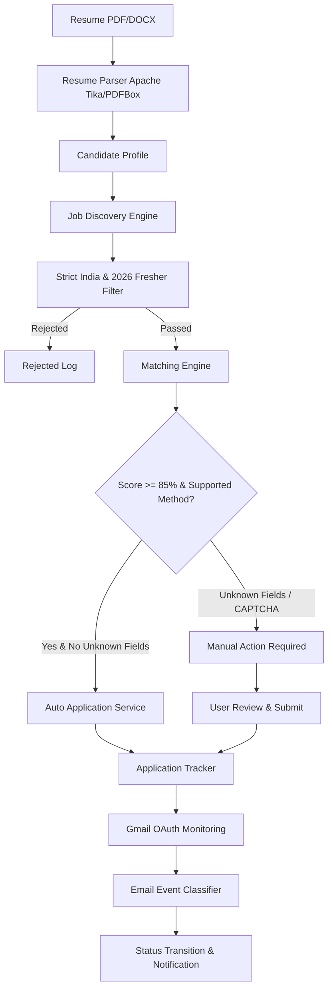

# AI Job Application Agent - Architecture Documentation

## 1. System Overview
The Personalized AI Job Application Agent is an autonomous and human-in-the-loop application designed for Indian IT/software 2026 freshers. It parses candidate resumes, discovers active Indian software developer jobs, strictly validates 2026 fresher eligibility, executes multi-dimensional matching, and safely auto-applies or transitions to manual action with clear handoff.

## 2. Guardrails & Hard Rules
1. **India-Only Hard Filter**: Rejects USA, UK, Canada, Australia, Europe, foreign remote jobs.
2. **2026 Batch / Fresher Filter**: Distinguishes "Job Posted in 2026" vs "Job accepting 2026 batch".
3. **Experience Ceiling**: Maximum 0-1 years. Rejects 2+ years, Senior, Lead, Manager.
4. **Zero-Hallucination Form Filling**: Stops immediately on unknown mandatory questions.
5. **No CAPTCHA / MFA Bypass**: Escalates to `MANUAL_ACTION_REQUIRED`.
6. **Configurable Daily Quota**: Default 10 applications/day.
7. **Idempotent Deduplication**: Prevents duplicate applications by canonical URL, Job ID, and (Company + Role + Location).
